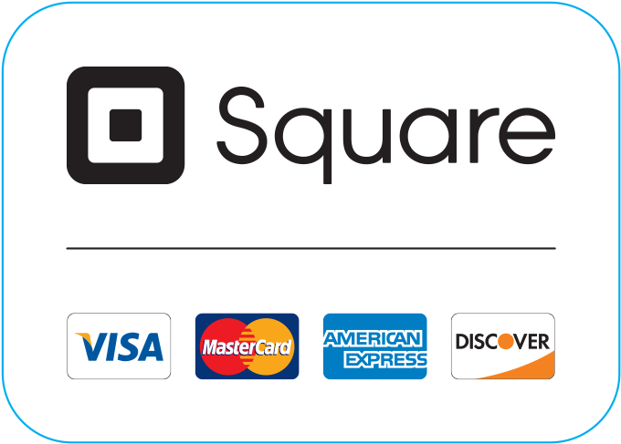
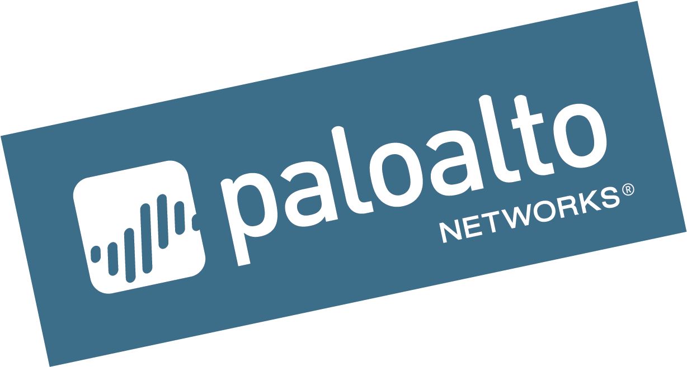

```{r setup, include=FALSE}
library(knitr)
knitr::opts_chunk$set(echo = TRUE)
library(tidyverse)
library(lubridate)
library(bizdays)
library(tidyquant)
library(ggplot2)
library(RColorBrewer)

```


# Introduction

The COVID-19 pandemic has had a devastating effect on the economy in the United States. There's no question that the coronavirus pandemic has completely upended our social norms and instilled an exceptionally high level of volatility into the stock market. But at the same time, it's also opened the door for opportunistic long-term investors to buy into some of the market's best stocks at a discount. 

As a student, I may also be a future investor. Based on some opinions about financial market on the Internet, I chose a portfolio that I think is reliable and implemented it. In this project, I assume that I have $250,000 in cash on July 1 and start investing. In order to get first-hand stock market information, I made a Shiny application to track the value of my portfolio.

# My portfolio

There's no lack of opinion about financial markets. After reading a lot of passages about stock market, I chose an opinion that I thought was highly professional to implement and purchased four stocks. The advisor's site is [here](https://www.fool.com/investing/2020/06/30/the-4-best-stocks-to-buy-for-the-second-half-of-20.aspx).

## Amazon


{width=200 length=200}


The first one, **Amazon**, is which I think is the best stocks to buy in the second half of 2020. Amazon has been a significant winner in the COVID-19 pandemic given its virtually insurmountable U.S. e-commerce market share. Amazon controls approximately 40% of all online sales in the United States. As the epidemic continues, I think this stock will benefit more from the epidemic, so it is a stock with good prospects. 

Because I think it is the most worthwhile stock to invest in, so I spent the most money to buy it, the amount is $100,000. According to the information posted on [www.dividend.com](https://www.dividend.com/stocks/consumer-discretionary/retail-discretionary/e-commerce-discretionary/amzn-amazoncom-inc) , this company does not have a dividend policy, so it is not necessary to consider dividends when calculating the value of this stock.

## Square


{width=200 length=200}


The second one, **Square**, is an American financial services, merchant services aggregator, and mobile payment company based in San Francisco, California[^1]. Affected by the COVID-19 pandemic, people are more enthusiastic about using Cash App. With consumers opting to use digital wallets to avoid potentially virus-ridden cash, it's quite plausible that Cash App's monthly active users are now well above 30 million. With the ability to link to cash card for use as a traditional debit card, invest directly from Cash App, and transfer to and from bank accounts, Cash App looks to be Square's golden ticket to riches.

For Square, I spent $50000. According to the information posted on [www.dividend.com](https://www.dividend.com/stocks/financials/specialty-finance/consumer-finance/sq-square-inc/), this company does not have a dividend policy, so it is not necessary to consider dividends when calculating the value of this stock.

[^1]:Reference:Wikipedia. Here's the weblink:[*Square*](https://en.wikipedia.org/wiki/Square,_Inc.)

## Palo Alto Networks


{width=200 length=200}


The third one, **Palo Alto Networks**, is known as a cybersecurity company. Its core products are a platform that includes advanced firewalls and cloud-based offerings that extend those firewalls to cover other aspects of security. Affected by the COVID-19 pandemic, at the end of June, it is foreseeable that there will still be a long time for people to work from home in the second half of 2020. With more people than ever working from home, the need to protect enterprise clouds from exogenous threats is heightened. That's why Palo Alto Networks gets the nod.

For Square, I spent $50000 as well. Identically, this company does not have a dividend policy, so it is not necessary to consider dividends when calculating the value of this stock. The details are posted on [www.dividend.com](https://www.dividend.com/stocks/technology/software/infrastructure-software/panw-palo-alto-networks-inc/).

## Green Thumb Industries


{width=200 length=200}


However, the last one, **Green Thumb Industries**, is a company controlling the seed-to-sale process for cannabis. It has 46 open dispensaries in select legal states, with licenses to open as many as 96 retail locations in 12 states. This company does not seem to be able to benefit much from the sudden outbreak of the COVID-19 pandemic, but it is a good choice to buy some as an investment. Another passage, [*Green Thumb Industries Opens Its 46th Retail Store*](https://marketrealist.com/2020/06/green-thumb-industries-opens-46th-retail-store/), states that this company outperforms its peers. In May, the company reported an impressive first-quarter performance and the strong performance led to a rise in the company’s stock price.

For Green Thumb Industries, I spent $50000 either. Actually, I am optimistic about this stock because I read several articles that have a positive attitude towards it. Like the above stocks, it has no dividend policy. The details are posted on [www.dividend.com](https://www.dividend.com/stocks/health-care/biotech-pharma/specialty-pharma/gtbif-green-thumb-industries-inc-ordinary-shares-sub-voting/).


# Financial result

In order to clearly see the changes in the value of my portfolio, I drew two charts, one showing the changes in the value of the four stocks over time, and one showing the total value over time.

```{r,echo=FALSE,warning=FALSE}
# Import Data
options("getSymbols.warning4.0"=FALSE)
options("getSymbols.yahoo.warning"=FALSE)

getSymbols(c("AMZN","SQ","PANW","GTBIF"),from="2020-07-01",
           to="2020-12-01",warnings = FALSE,auto.assign = TRUE)

# Cleaning
amzn <- data.frame(date=index(AMZN),AMZN) %>% 
  select(,date,AMZN.Close)
sq <- data.frame(date=index(SQ),SQ) %>% 
  select(,date,SQ.Close)
panw <- data.frame(date=index(PANW),PANW) %>% 
  select(,date,PANW.Close)
gtbif <- data.frame(date=index(GTBIF),GTBIF) %>% 
  select(,date,GTBIF.Close)

# Stock holdings
a_holding <- 100000/amzn[1,]$AMZN.Close
s_holding <- 50000/sq[1,]$SQ.Close
p_holding <- 50000/panw[1,]$PANW.Close
g_holding <- 50000/gtbif[1,]$GTBIF.Close

# Earning
amzn$earning <- a_holding*amzn$AMZN.Close-100000
sq$earning <- s_holding*sq$SQ.Close-50000
panw$earning <- p_holding*panw$PANW.Close-50000
gtbif$earning <- g_holding*gtbif$GTBIF.Close-50000

# Merge
earning <- select(amzn,date,earning)
earning$s <- sq$earning
earning$p <- panw$earning
earning$g <- gtbif$earning

earning <- mutate(earning,total=earning+s+p+g)

# plot
ggplot()+
  geom_line(data = earning,aes(x=date,y=earning,col=brewer.pal(9,"Reds")[8]))+
  geom_line(data = earning,aes(x=date,y=s,col=brewer.pal(11,"BrBG")[1]))+
  geom_line(data = earning,aes(x=date,y=p,col=brewer.pal(11,"BrBG")[11]))+
  geom_line(data = earning,aes(x=date,y=g,col=brewer.pal(9,"Oranges")[6]))+
  labs(title = "Revenue of My Portfolio",subtitle = "The four stocks",
       x="Time",y="Earnings($)")+
  theme(plot.title = element_text(hjust = 0.5),
        plot.subtitle = element_text(hjust = 0.5) )+
  scale_color_discrete(name = "Stocks", labels = c("Amazon", "Square","Palo Alto Networks","Green Thumb Industries"))
  

ggplot(data = earning)+
  geom_line(aes(x=date,y=total),col="royalblue")+
  labs(title = "Revenue of My Portfolio",subtitle = "Total",
       x="Time",y="Total Earnings($)")+
  theme(plot.title = element_text(hjust = 0.5),
        plot.subtitle = element_text(hjust = 0.5) )
 

  
```

As can be seen from the chart, all the four stocks were profitable on December 1. 

My most invested stock, Amazon, had very little profit on December 1. There was even a stock price loss in early November. However, the least famous stock I invested in, Green Thumb Industries, made the most profit on December 1. Since December 1 is not a stock opening day, I returned all the stocks to cash at the closing price of November 30. Finally, I got 369413.2 dollars in cash, which means I earned 119413.2 dollars from July 1 to December 1 through my portfolio.

In addition, I created a shinyapp as a portfolio tracking tool to track my portfolio. In this shinyapp, you can select any date, get the stock price chart of the four stocks I invested in, and give the value of my portfolio as of that date.


# Bibliography

1. The 4 Best Stocks to Buy for the Second Half of 2020. Weblink: [*https://www.fool.com/investing/2020/06/30/the-4-best-stocks-to-buy-for-the-second-half-of-20.aspx*](https://www.fool.com/investing/2020/06/30/the-4-best-stocks-to-buy-for-the-second-half-of-20.aspx).

2. Green Thumb Industries Opens Its 46th Retail Store. Weblink: [*https://marketrealist.com/2020/06/green-thumb-industries-opens-46th-retail-store*](https://marketrealist.com/2020/06/green-thumb-industries-opens-46th-retail-store/).

3. Dividend related information: [*www.dividend.com*](www.dividend.com)

4. R packages: shiny, tidyverse, tidyquant, bizdays, lubridate, ggplot2, RColorBrewer.